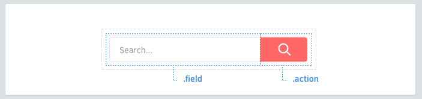

# 元素

组件由元素组成。



## 元素命名

每个组件都可能会有元素。元素的类应该只有 **一个单词**。

```scss
.search-form {
  > .field { /* ... */ }
  > .action { /* ... */ }
}
```

## 元素选择器

尽可能使用 `>` 子选择器。这可以防止内嵌组件冲突，性能也比后代选择器好。

```scss
.article-card {
  .title     { /* 可以 */ }
  > .author  { /* ✓ 更好 */ }
}
```

## 当多个单词的时候

当有两个或更多单词的时候，不要使用横杠或者下划线连接，直接写在一起。

```scss
.profile-box {
  > .firstname { /* ... */ }
  > .lastname { /* ... */ }
  > .avatar { /* ... */ }
}
```

## 避免标签选择器

尽可能使用类名。标签选择器没问题，但是可能会有性能上的损耗而且不是非常语意化。

```scss
.article-card {
  > h3    { /* ✗ 避免这样 */ }
  > .name { /* ✓ 更好 */ }
}
```

不是所有的元素都应该这样。 变体也很有用（变体：Variants，这里翻译为变体）。
[继续 →](variants.md)
<!-- {p:.pull-box} -->
