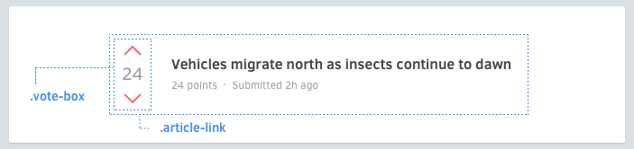

# 嵌套组件



```html
<div class='article-link'>
  <div class='vote-box'>
    ...
  </div>
  <h3 class='title'>...</h3>
  <p class='meta'>...</p>
</div>
```

有时候需要嵌套组件。这里是一些嵌套组件的宝典。

## 变体
一个组件可能会以嵌套在另一个组件内的形式存在。要避免从父组件更改嵌套在里面的组件。

```scss
.article-header {
  > .vote-box > .up { /* ✗ 要避免这样 */ }
}
```
  
  正确的方法是，给嵌套里面的组件增加一个变体。
  
```html
<div class='article-header'>
  <div class='vote-box -highlight'>
    ...
  </div>
  ...
</div>
```

```scss
.vote-box {
  &.-highlight > .up { /* ... */ }
}
```

## 精简嵌套组件
有时，嵌套组件会使你的标记变得肮脏。

```html
<div class='search-form'>
  <input class='input' type='text'>
  <button class='search-button -red -large'></button>
</div>
```

你可以通过 SCSS（CSS 预处理器）的 `@extend` 精简它：

```html
<div class='search-form'>
  <input class='input' type='text'>
  <button class='submit'></button>
</div>
```

```scss
.search-form {
  > .submit {
    @extend .search-button;
    @extend .search-button.-red;
    @extend .search-button.-large;
  }
}
```

那么对于像列表那样的重复元素该怎么处理？了解布局。
[继续 →](layouts.md)
<!-- {p:.pull-box} -->
