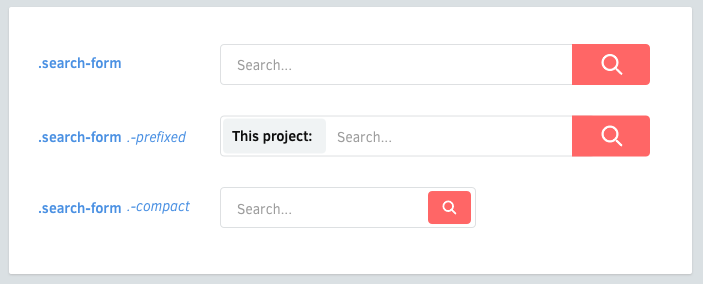

# 变体
组件可能会有变体。元素也可能会有。



<br>

## 变体命名
在变体类名加个 横杠（`-`）前缀。

  ```scss
  .like-button {
    &.-wide { /* ... */ }
    &.-short { /* ... */ }
    &.-disabled { /* ... */ }
  }
  ```

## 元素变体
元素也可能会有变体。

  ```scss
  .shopping-card {
    > .title { /* ... */ }
    > .title.-small { /* ... */ }
  }
  ```

## 横杠前缀
横杠作为变体前缀是比较推荐的：

  * 可以防止歧义的元素。
  * CSS 类只能以一个字符开头, `_` 或 `-`。
  * 横杠比下划线更容易输入。
  * 有点类似于 UNIX 命令行 (`gcc -O2 -Wall -emit-last`)。

如何处理复杂的元素？嵌套它们！
[继续 →](nested-components.md)
<!-- {p:.pull-box} -->
